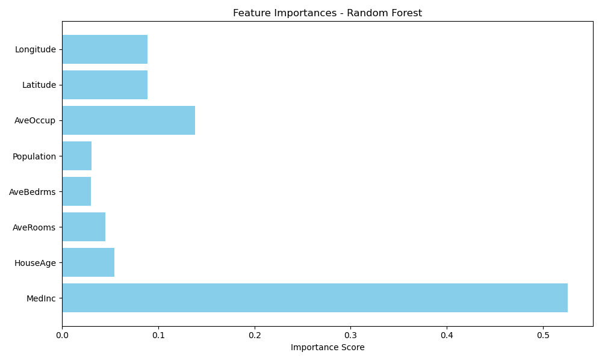
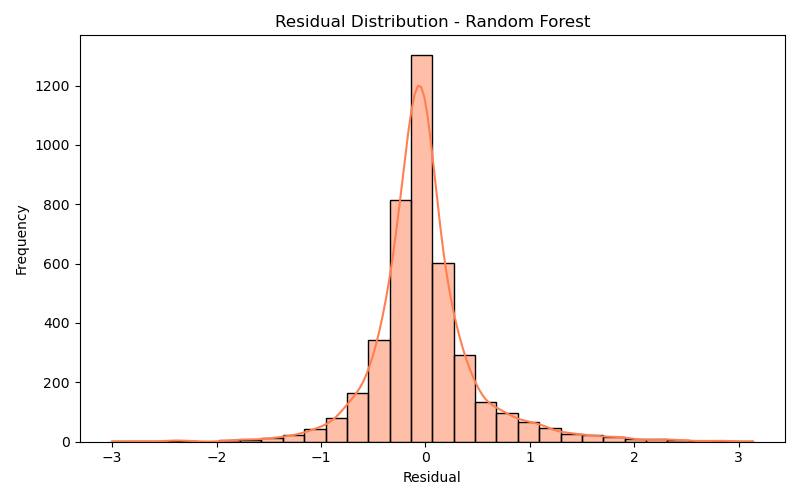

# California House Price Prediction

This project aims to predict median house prices in California using the **California Housing Dataset** from `scikit-learn`. It demonstrates an end-to-end Machine Learning pipeline: data preprocessing, modeling, hyperparameter tuning, evaluation, and visualization.

---

## Files Included

- `california-housing-prediction.ipynb` → Main notebook
- `images/` → Contains generated plots
- `README.md`, `requirements.txt` → Documentation and dependencies

## Problem Statement

Given features like median income, average rooms, location, and occupancy, predict the **median house value** for California districts.

---

## Workflow

- Load and inspect the dataset
- Preprocess data using `MinMaxScaler`
- Train baseline **Linear Regression**
- Tune and train **Random Forest Regressor**
- Evaluate using **MSE, R² Score, MAE**
- Visualize feature importance and residuals

---

## Results

| Model              | R² Score | MAE     |
|-------------------|----------|---------|
| Linear Regression | ~0.57    | ~$53,000 |
| Random Forest     | ~0.81    | ~$33,000 |

Random Forest performed significantly better after tuning, reducing prediction error by ~38%.

---

## Visualizations

### 🔹 Feature Importance

### 🔹 Residual Distribution

---

## Dataset

- California Housing Dataset — available directly from `sklearn.datasets`

---

## Skills Used

- Python, Pandas, Numpy, Matplotlib, Seaborn
- Scikit-learn: Regression, Scaling, GridSearchCV
- Data cleaning & visualization
- Model evaluation and tuning

---

## Author

**Harsh Dharnidharka**  
Aspiring AI Developer | [LinkedIn](https://www.linkedin.com/in/harsh-dharnidharka-2a855a325/) | [GitHub](https://github.com/Harsh251005)

---

## Potential Improvements

- Implement XGBoost or LightGBM to compare with Random Forest
- Build a simple Streamlit app for real-time predictions
- Add cross-validation metrics like RMSE and MAPE